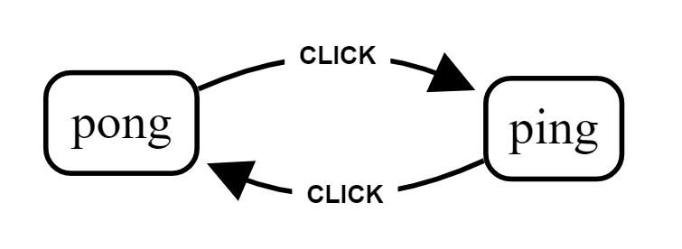

# react-xstate
Connecting react components with [xstate](https://github.com/davidkpiano/xstate) state machine library.

# Why?
`react-xstate` gives you easy access to [xstate](https://github.com/davidkpiano/xstate) in the react world! ;)

Xstate allows you to improve state handling of your components by applying formal definition of a state machine including states and transitions. This allows you to better separate business logic from state handling and separate them into different files. You can use `react-xstate` to transition your UI-programming to model-driven-development which besides better code structure removes major error source and enables visual documentation.

##### The xstate library
This library bases on the [xstate](https://github.com/davidkpiano/xstate) by David Khourshid
- 📖 [Read the documentation!](http://davidkpiano.github.io/xstate/docs)
- Get inspired by [📽 the slides](http://slides.com/davidkhourshid/finite-state-machines) ([🎥 video](https://www.youtube.com/watch?v=VU1NKX6Qkxc))
- [Statecharts - A Visual Formalism for Complex Systems](http://www.inf.ed.ac.uk/teaching/courses/seoc/2005_2006/resources/statecharts.pdf) by David Harel
- Checkout [xstate visualizer](https://codepen.io/davidkpiano/details/ayWKJO) for graph generation by David Khourshid

##### Deep dive
The `xstate` library implements the formal processing of state machines and leaves handling transitions, updating state and reducing actions to the user. This is where `react-xstate` comes into play and integrates state and transition handling directly into your react components, only by applying a `state machine` and `action reducers` and returning a `xstate` prop and a transition function.


# Installation
1. ``npm install react-xstate --save``
2. ``import { mountXstate } from 'react-xstate'``

# Usage
Mount the xstate machine to your component by applying a `machine` definition and at least one `actionReducer` to your component.

```js
mountXstate(appMachine, [appReducer])(App)
```

## Example
This simple state machine implements an easy to use statechart that transitions between ping and pong and when you click in state ping you will trigger the `consoleLog` action.



#### State Machine
````js
const appMachine = {
  initial: 'pending',
  states: {
    ping: {
      on: {
        CLICK: {
          pong: { actions: ['consoleLog'] }
        }
      }
    },
    pong: {
      on: {
        CLICK: 'ping',
      }
    },
  }
}
````

#### Action Reducer
````js
const appReducer = (action) => {
  if(action === 'consoleLog') {
    console.log('Fired action: consoleLog')
  }
}
````

#### Stateful Component

````js
class App extends Component {
  constructor(props) {
    super(props);
    this.handleSubmit = this.handleSubmit.bind(this);
  }
  handleSubmit() {
    // See transition definition prop below  
    this.props.transition({ type: 'CLICK' })
  }
  render() {
    const { xstate: { value: state } } = this.props
    console.log(`State: ${JSON.stringify(state)}`)
    return (
      <button onClick={this.handleSubmit}>Click</button>
    );
  }
}

export default mountXstate(appMachine, [appReducer])(App)
````

# API

## withXstate(statechart, [actionReducer])(Component)

The `withXstate` higher-order component takes a statechart definition (see [xstate](https://github.com/davidkpiano/xstate)), an array of [actionReducers](#actionReducer(action,-event,-xstate)) and a component.
It adds and exposes two new [props](#props) to your component: `transition` and `xstate`.

### actionReducer(action, event, xstate)

``ActionReducers`` are functions that are mounted onto the state machine and called upon every action execution. Return should be an object that is passed through as additional state onto the xstate prop.

| Arg | Type | Description |
| ------ | ---- | ----------- |
| action | string | Returns the current action called. |
| event | object | Additional payload of the transition triggering the action. |
| xstate | object | Access the xstate component itself to e.g. call transition from action. |

````js
const reducer = (action, event, xstate) => {
  const { transition } = xstate
  if(action === 'loadData') {
    fetch(event.url, event.payload)
    return { loading: true }
  }
}
````

## Props

### transition(event): function

This function is hooked onto your components props and fires events towards your state machine. Expects an object with the event ``type`` and optionally and additional action payload that can be used by actionReducers to update the state.

```js
handleClick = () => {
  this.props.transition({ type: 'FETCH', url: 'http://github.com' })
}
```
#### Queueing transitions
To enable transition chains by calling transition in action reducers we included a queued transition handling that queues transitions while there is already one transition happening.

### xstate: object

This object exposes the [state](http://davidkpiano.github.io/xstate/docs/#/api/state) of the state machine, including action reduced state, to enable the user to build stateful component logic.

```js
render = () => {
  const { xstate: { value: state } } = this.props
  return (
    <div>
      <button>Send</button>
      {state === 'loading' && <div>Loading...</div>}
    </div>
  );
}
```
